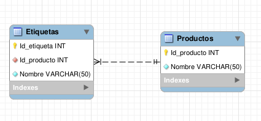
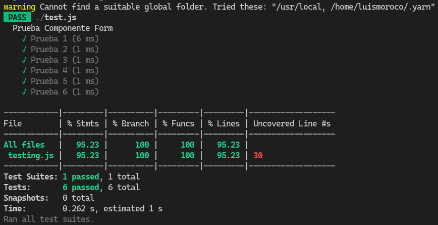

# Prueba Técnica - CRUD - BlueCorner

- Este es un CRUD(Create, Remove, Update y Delete) en base a 2 Tablas 1:N -> Relación de 1 a Muchos. Cada Producto puede tener muchas etiquetas.

## Desarrollador

- Luis Angel Moroco Ramos

## Pre - Requisitos 

- ReactJS
- NodeJS 
- MySQL
- Javascript

## Tecnologías adicionales 

- Jest : Pruebas 
- Selenium : Entorno de pruebas de Sotware
- ChromeWebdriver : Controlador para Buscador
- Express : Framework de desarrollo 
- Dotenv : Variables globales
- Axios : Solicitudes HTTP
- Jenkins : Orquestador 
- GoogleChrome : Navegador

## Técnicas usadas 

- Base de datos : Procedimientos almacenado y LinkTable 1:N
- Patrón de Diseño : Modelo Vista Controlador 
- Procesamiento : HTTP, Funciones asincronas, Promesas

## Testing

- Usé Selenium, Jest y promesas para testear la App
- El software responde bien el 100% de las veces

## Construcción

El proyecto consta de dos partes:
- Backend : servidor - Lado del desarrollador
- Fronted : Lado del cliente
Ambos se comunican usando `Axios` y peticiones `HTTP`

### 1. Clonar el repositorio 

- Ejecutar `git clone https://github.com/luismoroco/BlueCorner.git` en cualquier fichero de la PC.
- Instalar las dependencias `yarn install` o `npm install`

### 2. Levantar la base datos

- Ejecutar el script [script](https://github.com/luismoroco/BlueCorner/blob/main/backend/db/dbModel.sql) preferentemente en MySQL Workbench.
- Debe ir a [env](https://github.com/luismoroco/BlueCorner/blob/main/backend/env/.env) y configurar : El nombre de su servidor local, su usuario y contraseña.
- Las variable de DB_DATABSE está configurada por defecto.

### 3. Levantar el servidor del Backend

- Ejecutaremos `cd backend`, para acceder al directorio del backend
- Instaremos las dependecias Luego `yarn install` o `npm install`
- Usamos `nodemon server`, activar el servidor.

### 4. Levantar el servidor del Fronted

- Volveremos al directorio pricipal con `cd ..` 
- Entraremos al directorio del Fronted `cd fronted`
- Instaremos las dependecias con `yarn install` o `npm install`
- Activamos el servidor `yarn start` o `npm start`

### 5. Testing

- Volveremos al directorio pricipal con `cd ..` 
- Ejecutaremos las pruebas con `yarn run dev` o `npm run test`

Podemos dirigirnos a [localhost:3000](http://localhost:3000) para interactuar con el software.

El procedimiento está descrito en Jenkins.

## Happy Hacking!